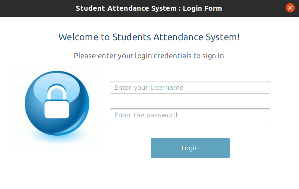
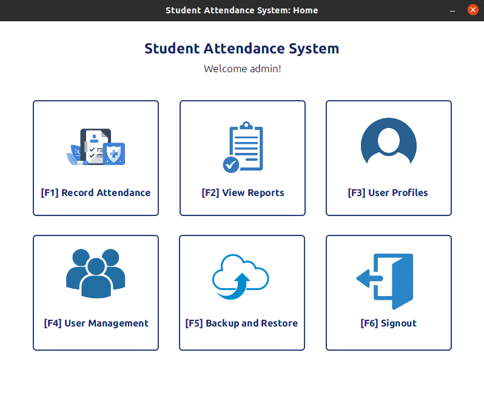
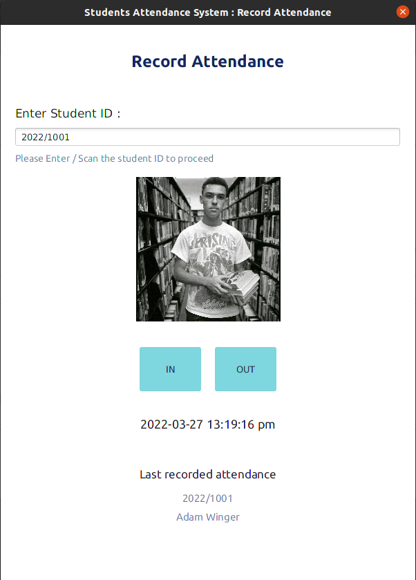

# Student Attendance System - V 0.1.0

### Introduction
This repository is where I develop a simple system to mark students attendance. I have developed this system to improve the knowledge about java FX, JDBC, java and other technologies.
The source code is available to everyone under the standard [MIT License](https://choosealicense.com/licenses/mit/).

### License
Copyright © 2022 -  B G Thakshila Nuwangi. All rights reserved.

Licensed under the [MIT License](https://choosealicense.com/licenses/mit/)